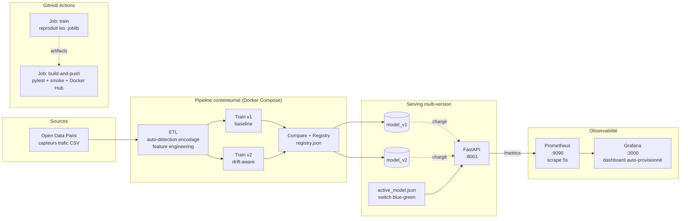

# 🚦 InfoTrafic — Prédiction temps réel du trafic, façon MLOps

[](https://github.com/Mael8zinsou/Info_Trafic/actions/workflows/ci-cd.yaml)
[](https://www.python.org/downloads/)
[](https://docs.docker.com/compose/)
[](https://scikit-learn.org/)
[](https://fastapi.tiangolo.com/)
[](https://prometheus.io/)
[](https://grafana.com/)

> **Pipeline MLOps end-to-end** sur les données Open Data des capteurs de trafic parisiens : ETL → training reproductible → serving versionné en blue-green → observabilité live. Patterns de production dans une stack Docker Compose portable.

🇬🇧 *English version available at [docs/README.en.md](docs/README.en.md).*

---

## ✨ Highlights

- 🏗️ **Pipeline end-to-end** — Ingest → ETL → Training (v1 + v2) → Registry → Serving FastAPI → Monitoring
- 🔁 **Reproductible from scratch** — la CI rebuilde les modèles depuis des samples versionnés à chaque run
- 🟦🟩 **Blue-green deployment** — bascule v1 / v2 en éditant un seul fichier JSON, sans redémarrage
- 🕵️ **Shadow testing** — `/predict_v2` tourne en parallèle, compteur de désaccords exposé en Prometheus
- 📊 **Observabilité live** — dashboard Grafana auto-provisionné, 4 métriques ML custom + HTTP standard
- 🧪 **Validé par la CI** — pytest (schemas + models + API) + Docker smoke test + push d'image sur `Prod`
- 🛡️ **Modélisation drift-aware** — v2 sacrifie 8 points d'accuracy sur données propres pour rester robuste quand le capteur tombe en panne

---

## 🎬 Démo en 60 secondes

```bash
# 1. Démarrer la stack complète (API + Prometheus + Grafana)
docker compose -p infotraf up -d --build serving prometheus grafana

# 2. Générer du trafic synthétique pour faire vivre le dashboard
python scripts/load_test.py --duration 120 --rps 5

# 3. Ouvrir :
#    - Dashboard Grafana : http://localhost:3000/d/infotrafic-serving
#    - Swagger UI        : http://localhost:8001/docs
#    - Prometheus        : http://localhost:9090
```

> Le dashboard Grafana fonctionne en mode anonyme (Viewer) — pas besoin de login pour voir les métriques.

### Grafana — dashboard ML serving


*7 panels : active model gauge, total predictions, shadow disagreements, error rate, request rate par endpoint, latency p50/p95/p99 par version de modèle, predictions per class empilées.*

### Swagger UI — doc d'API auto-générée


---

## 🧠 Cas d'usage

Prédire l'état du trafic (`Fluide` / `Pré-saturé` / `Saturé` / `Bloqué`) d'un segment routier parisien à partir des données capteurs — Open Data Ville de Paris, dérive du monde réel incluse (`Etat arc=invalide` quand un capteur tombe en panne).

Deux modèles concurrents cohabitent en production :

| Modèle | Features | Accuracy (clean) | Comportement sous panne capteur |
| --- | --- | --- | --- |
| **v1** (baseline) | 7 features numériques | **0.99** | Reste optimiste — ignore `Etat arc` |
| **v2** (drift-aware) | 7 num + `Etat arc` catégorielle | **0.97** | Bascule vers "Pré-saturé" quand le capteur reporte `invalide` |

v2 sacrifie volontairement de l'accuracy sur données propres pour gagner en **robustesse face à la dégradation terrain**. L'endpoint shadow et le panel Grafana quantifient ce trade-off en live.

---

## 🏗️ Architecture



Trois couches faiblement couplées — le training écrit des artefacts, le serving les lit, le monitoring scrape l'API. Pas de couplage runtime entre training et serving.

---

## 🛠️ Stack technique

| Couche | Technologies |
| --- | --- |
| **Data engineering** | pandas 2.2 · pyarrow · auto-détection d'encodage CSV |
| **ML training** | scikit-learn 1.5.1 · joblib 1.4.2 · LogisticRegression + ColumnTransformer |
| **Serving** | FastAPI · Pydantic (aliases noms FR) · Uvicorn · APIKeyHeader auth |
| **Conteneurisation** | Docker · Docker Compose · Dockerfiles dédiés par service |
| **Observability** | prometheus-fastapi-instrumentator 7 · Prometheus 2.55 · Grafana 11.3 |
| **CI/CD** | GitHub Actions · 2 jobs (train / build-and-push) · Docker Hub · upload-artifact v4 |
| **Tests** | pytest 8.3 · FastAPI TestClient · httpx 0.28 |
| **Knowledge graph** | [graphify](https://github.com/safishamsi/graphify) (54 nodes, 14 communautés, dans `graphify-out/`) |

### Pourquoi chaque brique compte

#### Data Engineering — ETL robuste sur des données réelles
L'ETL [auto-détecte l'encodage](src/etl/app.py) (UTF-8 BOM, UTF-8, ISO-8859-1) parce qu'Open Data n'est pas toujours propre. Les CSV sont historisés à chaque run dans `data/processed/history/` pour l'audit. Le feature engineering crée les features temporelles (`heure`, `jour_semaine`, `is_weekend`) et extrait lat/lon d'un champ `geo_point_2d` packé.

#### ML — deux modèles concurrents, une stratégie anti-drift
v1 est la baseline (haute accuracy sur données propres). v2 ajoute la feature catégorielle `Etat arc` pour que le modèle puisse se méfier quand un capteur est en panne. Les deux livrent ensemble ; `active_model.json` décide lequel sert `/predict`. Voir [docs/projet_academique.md](docs/projet_academique.md#3-entraînement--retraining).

#### Serving — blue-green deployment sans redémarrage
[`get_active_version()`](serving/app.py) relit `active_model.json` à chaque requête. Basculer v1 → v2 c'est `echo '{"active":"v2"}' > models/active_model.json` — instantané, pas de rolling restart, pas de perte de trafic.

#### Observability — 4 métriques ML custom, dashboard provisionné
Le serving expose [`/metrics`](http://localhost:8001/metrics) avec `ml_predictions_total`, `ml_prediction_latency_seconds`, `ml_active_model`, `ml_shadow_disagreements_total`. Grafana charge le dashboard depuis `monitoring/grafana/dashboards/` au boot — pas d'import manuel. Runbook complet : [docs/monitoring.md](docs/monitoring.md).

#### CI/CD — entièrement reproductible
La CI a deux jobs. Le premier (`train`) lance l'ETL sur les samples versionnés, entraîne v1 + v2, et upload les fichiers `.joblib` en artefacts. Le second (`build-and-push`) les télécharge, lance pytest (10 tests), démarre le container serving, smoke-test `/health`, puis build et push l'image de training sur Docker Hub. **Depuis un clone propre, toute la stack peut être rebuildée par GitHub Actions seul.**

---

## 🧪 Ce que fait la CI à chaque push sur `Prod`

```
┌─────────────────────────────────┐    artefacts     ┌────────────────────────────────────┐
│ Job 1: train                    │ ───────────────▶ │ Job 2: build-and-push              │
│ • ETL sur samples versionnés    │  models/*.joblib │ • download artefacts               │
│ • train v1 (baseline)           │  registry.json   │ • pytest tests/ (schemas/models/API)│
│ • train v2 (drift-aware)        │                  │ • démarre serving, curl /health    │
│ • compare + registry            │                  │ • docker build + push Docker Hub   │
│ • upload-artifact (30j)         │                  │                                    │
└─────────────────────────────────┘                  └────────────────────────────────────┘
            ~2 min                                                  ~3 min
```

Les deux jobs doivent passer pour que le badge reste vert. Run en cours : voir l'[onglet Actions](https://github.com/Mael8zinsou/Info_Trafic/actions).

---

## 📁 Structure du dépôt

```
InfoTrafic/
├── .github/workflows/ci-cd.yaml      # CI 2 jobs : train → build-and-push
├── data/samples/                     # CSV Open Data versionnés (reproductibilité CI)
├── docker/                           # Un Dockerfile par service + requirements
├── docker-compose.yml                # Serving + stack monitoring
├── docs/                             # Architecture, ETL, serving, monitoring, gouvernance
│   ├── monitoring.md                 # Runbook Prometheus + Grafana
│   ├── projet_academique.md          # Contexte académique (YNOV)
│   └── README.en.md                  # Version anglaise du présent README
├── monitoring/
│   ├── prometheus/prometheus.yml     # Config scrape 5s
│   └── grafana/                      # Provisioning datasource + dashboard
├── scripts/
│   ├── load_test.py                  # Générateur de trafic synthétique
│   └── shadow_test.py                # Runner conteneurisé pour comparer v1/v2
├── serving/
│   ├── app.py                        # App FastAPI avec 4 métriques ML
│   └── schemas.py                    # Pydantic avec aliases FR
├── src/
│   ├── etl/                          # ETL avec auto-détection d'encodage
│   ├── training/                     # train v1/v2 + compare + evaluate
│   └── utils/                        # log_utils, ml_utils, S3
└── tests/                            # 10 tests pytest (schemas, models, API)
```

---

## 📚 Documentation détaillée

| Doc | Contenu |
| --- | --- |
| [docs/architecture.md](docs/architecture.md) | Architecture détaillée et flux de données |
| [docs/etl.md](docs/etl.md) | Pipeline ETL et gestion de la dérive |
| [docs/serving_api.md](docs/serving_api.md) | Endpoints API, shadow testing, blue-green |
| [docs/monitoring.md](docs/monitoring.md) | Prometheus + Grafana — runbook complet |
| [docs/run_local.md](docs/run_local.md) | Guide d'exécution local |
| [docs/Docker.md](docs/Docker.md) | Stratégie de conteneurisation |
| [docs/registre_ia.md](docs/registre_ia.md) | Registre IA / RGPD |
| [docs/gouvernance_ia.md](docs/gouvernance_ia.md) | Gouvernance IA, procédures de rollback |
| [docs/difficultes_et_ameliorations.md](docs/difficultes_et_ameliorations.md) | Post-mortem + roadmap |
| [docs/projet_academique.md](docs/projet_academique.md) | Contexte académique (YNOV) |
| [docs/README.en.md](docs/README.en.md) | English version of this README |

---

## 🚧 Limitations connues & prochaines étapes

Transparent sur ce qui n'est pas fait — c'est un projet portfolio, pas un produit fini.

- **Déploiement cloud (AWS)** — Compose file prêt ([docker-compose.aws.yml](docker-compose.aws.yml)), déploiement ECS non finalisé.
- **HTTPS** — géré au niveau du reverse proxy dans un vrai déploiement ; pas dans la stack locale.
- **Drift detection (Evidently AI)** — le compteur de désaccords actuel est le v0 ; la détection statistique de drift est la prochaine étape.
- **Job de retraining** — la CI rebuilde les modèles à chaque push, mais un pipeline de retraining planifié sur les vraies données Open Data fermerait la boucle.
- **`@app.on_event` deprecated** dans FastAPI — devrait migrer vers les `lifespan` events (8 DeprecationWarnings dans les tests).

---

## 👤 Auteur

**Maël ZINSOU** — Data Engineering / MLOps
Construit dans le cadre du cursus M2 *Industrialisation de l'IA dans le Cloud* (YNOV), puis re-engineeré comme projet portfolio.

🔗 [LinkedIn](https://www.linkedin.com/in/) · 📫 maelzinsou@proton.me

---

📌 *Pour le contexte académique d'origine, voir [docs/projet_academique.md](docs/projet_academique.md).*
