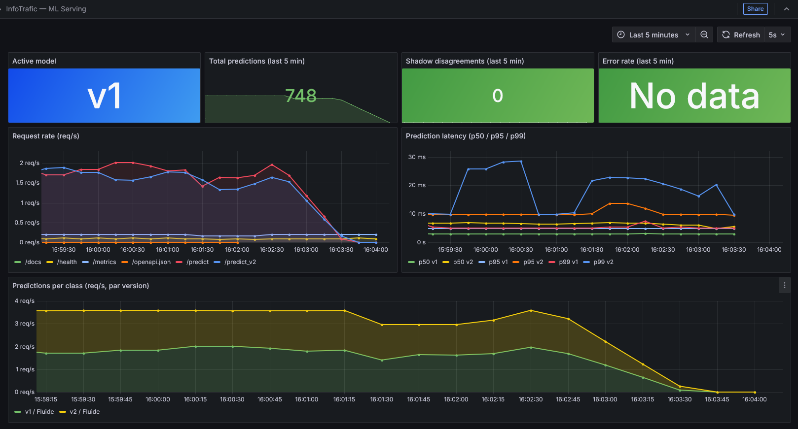
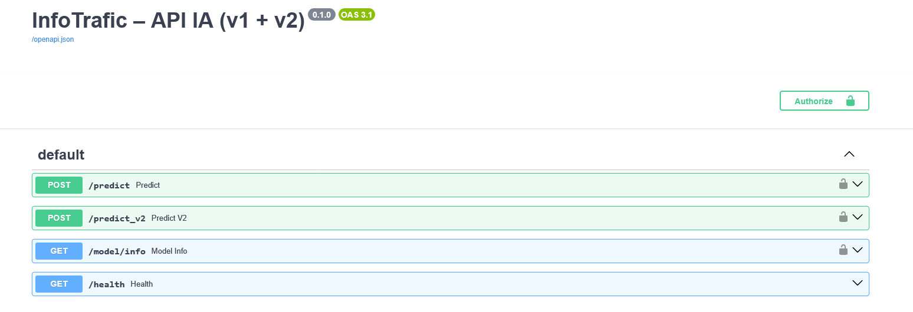
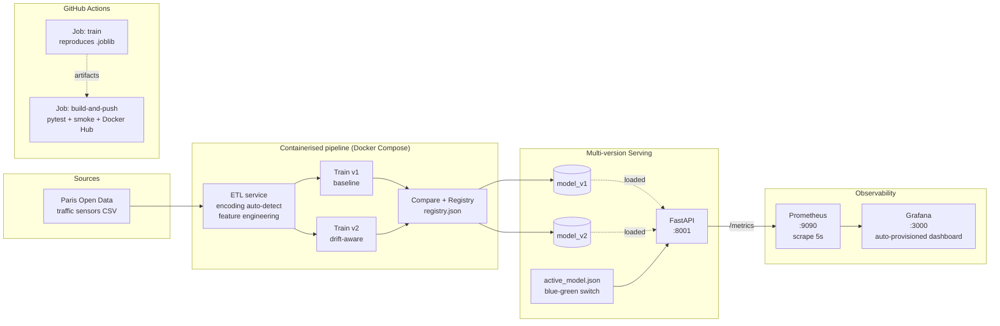

# 🚦 InfoTrafic — Real-time traffic prediction, the MLOps way

[](https://github.com/Mael8zinsou/Info_Trafic/actions/workflows/ci-cd.yaml)
[](https://www.python.org/downloads/)
[](https://docs.docker.com/compose/)
[](https://scikit-learn.org/)
[](https://fastapi.tiangolo.com/)
[](https://prometheus.io/)
[](https://grafana.com/)

> **End-to-end MLOps pipeline** on Paris Open Data traffic sensors: ETL → reproducible training → versioned blue-green serving → live observability. Production patterns in a portable Docker Compose stack.

🇫🇷 *Version française disponible à la racine : [README.md](../README.md).*

---

## ✨ Highlights

- 🏗️ **End-to-end pipeline** — Ingest → ETL → Training (v1 + v2) → Registry → FastAPI serving → Monitoring
- 🔁 **Reproducible from scratch** — CI builds the models from versioned samples on every run
- 🟦🟩 **Blue-green deployment** — switch between v1 / v2 by editing a single JSON file, no restart
- 🕵️ **Shadow testing** — `/predict_v2` runs in parallel, disagreement counter exposed in Prometheus
- 📊 **Live observability** — Grafana dashboard auto-provisioned with 4 custom ML metrics + standard HTTP
- 🧪 **CI-validated** — pytest (schemas + models + API) + Docker smoke test + image push on `Prod`
- 🛡️ **Drift-aware modelling** — v2 trades 8 points of accuracy on clean data for robustness against sensor failure

---

## 🎬 60-second demo

```bash
# 1. Bring up the full stack (API + Prometheus + Grafana)
docker compose -p infotraf up -d --build serving prometheus grafana

# 2. Generate synthetic traffic to bring the dashboard to life
python scripts/load_test.py --duration 120 --rps 5

# 3. Open:
#    - Grafana dashboard : http://localhost:3000/d/infotrafic-serving
#    - Swagger UI        : http://localhost:8001/docs
#    - Prometheus        : http://localhost:9090
```

> The Grafana dashboard works in anonymous Viewer mode out of the box. No login required to see metrics flowing.

### Grafana — ML serving dashboard



*7 panels: active model gauge, total predictions, shadow disagreements, error rate, request rate per endpoint, latency p50/p95/p99 per model version, predictions per class stacked.*

### Swagger UI — auto-generated API docs



---

## 🧠 Use case

Predict the traffic state (`Fluide` / `Pré-saturé` / `Saturé` / `Bloqué`) of a Paris road segment from sensor data — open data from the City of Paris, real-world drift included (`Etat arc=invalide` when a sensor fails).

Two competing models live in production:

| Model | Features | Accuracy (clean) | Behaviour under sensor failure |
| --- | --- | --- | --- |
| **v1** (baseline) | 7 numerical features | **0.99** | Stays optimistic — ignores `Etat arc` |
| **v2** (drift-aware) | 7 num + `Etat arc` categorical | **0.97** | Hedges towards "Pré-saturé" when sensor reports `invalide` |

v2 deliberately sacrifices clean-data accuracy for **robustness under real-world degradation**. The shadow endpoint and Grafana panel quantify that trade-off live.

---

## 🏗️ Architecture



Three loosely-coupled layers — training writes artifacts, serving reads them, monitoring scrapes the API. No tight coupling, no synchronous runtime dependency between training and serving.

---

## 🛠️ Tech stack

| Layer | Technologies |
| --- | --- |
| **Data engineering** | pandas 2.2 · pyarrow · CSV auto-encoding detection |
| **ML training** | scikit-learn 1.5.1 · joblib 1.4.2 · LogisticRegression + ColumnTransformer |
| **Serving** | FastAPI · Pydantic (FR-name aliases) · Uvicorn · APIKeyHeader auth |
| **Containers** | Docker · Docker Compose · multi-stage Dockerfiles per service |
| **Observability** | prometheus-fastapi-instrumentator 7 · Prometheus 2.55 · Grafana 11.3 |
| **CI/CD** | GitHub Actions · 2 jobs (train / build-and-push) · Docker Hub · upload-artifact v4 |
| **Testing** | pytest 8.3 · FastAPI TestClient · httpx 0.28 |
| **Knowledge graph** | [graphify](https://github.com/safishamsi/graphify) (54 nodes, 14 communities, in `graphify-out/`) |

### Why each block matters

#### Data Engineering — robust ETL on real-world data
The ETL [auto-detects encoding](../src/etl/app.py) (UTF-8 BOM, UTF-8, ISO-8859-1) because Open Data isn't always clean. CSVs are historised per run in `data/processed/history/` for audit. Feature engineering creates temporal features (`heure`, `jour_semaine`, `is_weekend`) and extracts lat/lon from a packed `geo_point_2d` field.

#### ML — two competing models, one anti-drift strategy
v1 is the baseline (high accuracy on clean data). v2 adds the `Etat arc` categorical feature so the model can hedge when a sensor reports as failed. Both ship together; `active_model.json` decides which serves `/predict`. See [projet_academique.md](projet_academique.md#3-entraînement--retraining).

#### Serving — blue-green deployment without restart
[`get_active_version()`](../serving/app.py) re-reads `active_model.json` on every request. Switching v1 → v2 is `echo '{"active":"v2"}' > models/active_model.json` — instant, no rolling restart, no traffic loss.

#### Observability — 4 custom ML metrics, dashboard provisioned
The serving exposes [`/metrics`](http://localhost:8001/metrics) with `ml_predictions_total`, `ml_prediction_latency_seconds`, `ml_active_model`, `ml_shadow_disagreements_total`. Grafana picks up the dashboard from `monitoring/grafana/dashboards/` on boot — no manual import. Full runbook: [monitoring.md](monitoring.md).

#### CI/CD — fully reproducible
The CI has two jobs. The first (`train`) runs the ETL on versioned samples, trains v1 + v2, and uploads the `.joblib` files as artifacts. The second (`build-and-push`) downloads them, runs pytest (10 tests), boots the serving container, smoke-tests `/health`, then builds and pushes the training image to Docker Hub. **From a clean checkout the entire stack can be rebuilt by GitHub Actions alone.**

---

## 🧪 What the CI does on every push to `Prod`

```
┌─────────────────────────────────┐    artifacts     ┌────────────────────────────────────┐
│ Job 1: train                    │ ───────────────▶ │ Job 2: build-and-push              │
│ • ETL on versioned samples      │  models/*.joblib │ • download artifacts               │
│ • train v1 (baseline)           │  registry.json   │ • pytest tests/ (schemas/models/API)│
│ • train v2 (drift-aware)        │                  │ • boot serving, curl /health        │
│ • compare + registry            │                  │ • docker build + push to Docker Hub │
│ • upload-artifact (30d)         │                  │                                    │
└─────────────────────────────────┘                  └────────────────────────────────────┘
            ~2 min                                                  ~3 min
```

Both must pass for the badge to stay green. Latest run: see the [Actions tab](https://github.com/Mael8zinsou/Info_Trafic/actions).

---

## 📁 Repository structure

```
InfoTrafic/
├── .github/workflows/ci-cd.yaml      # 2-job CI: train → build-and-push
├── data/samples/                     # Open Data CSV samples (versioned for CI reproducibility)
├── docker/                           # One Dockerfile per service + requirements
├── docker-compose.yml                # serving + monitoring stack
├── docs/                             # Architecture, ETL, serving, monitoring, governance
│   ├── monitoring.md                 # Prometheus + Grafana runbook
│   └── projet_academique.md          # Academic context (YNOV)
├── monitoring/
│   ├── prometheus/prometheus.yml     # 5s scrape config
│   └── grafana/                      # Datasource + dashboard provisioning
├── scripts/
│   ├── load_test.py                  # Synthetic traffic generator
│   └── shadow_test.py                # Containerised v1/v2 comparison runner
├── serving/
│   ├── app.py                        # FastAPI app with 4 ML metrics
│   └── schemas.py                    # Pydantic with FR aliases
├── src/
│   ├── etl/                          # ETL with auto-encoding detection
│   ├── training/                     # train v1/v2 + compare + evaluate
│   └── utils/                        # log_utils, ml_utils, S3
└── tests/                            # 10 pytest tests (schemas, models, API)
```

---

## 📚 Deep-dive documentation

| Doc | What's in it |
| --- | --- |
| [architecture.md](architecture.md) | Detailed architecture and data flow |
| [etl.md](etl.md) | ETL pipeline and drift handling |
| [serving_api.md](serving_api.md) | API endpoints, shadow testing, blue-green |
| [monitoring.md](monitoring.md) | Prometheus + Grafana — full runbook |
| [run_local.md](run_local.md) | Local execution guide |
| [Docker.md](Docker.md) | Containerisation strategy |
| [registre_ia.md](registre_ia.md) | AI registry / GDPR |
| [gouvernance_ia.md](gouvernance_ia.md) | AI governance, rollback procedures |
| [difficultes_et_ameliorations.md](difficultes_et_ameliorations.md) | Post-mortem + roadmap |
| [projet_academique.md](projet_academique.md) | Academic context (YNOV) |

---

## 🚧 Known limitations & next steps

Transparent about what's not done — this is a portfolio project, not a finished product.

- **Cloud deployment (AWS)** — Compose file ready ([docker-compose.aws.yml](../docker-compose.aws.yml)), ECS deploy not finalised.
- **HTTPS** — handled at the reverse proxy layer in a real deploy; not in the local stack.
- **Drift detection (Evidently AI)** — current shadow disagreement counter is the v0; statistical drift detection is the next step.
- **Model retraining job** — CI rebuilds models on every push, but a scheduled retraining pipeline on fresh Open Data would close the loop.
- **`@app.on_event` deprecated** in FastAPI — should migrate to `lifespan` events (8 DeprecationWarnings in tests).

---

## 👤 Author

**Maël ZINSOU** — Data Engineering / MLOps
Built as part of the YNOV M2 *Industrialisation de l'IA dans le Cloud* curriculum, then re-engineered as a portfolio project.

🔗 [LinkedIn](https://www.linkedin.com/in/) · 📫 maelzinsou@proton.me

---

📌 *For the original academic-context README, see [projet_academique.md](projet_academique.md).*
